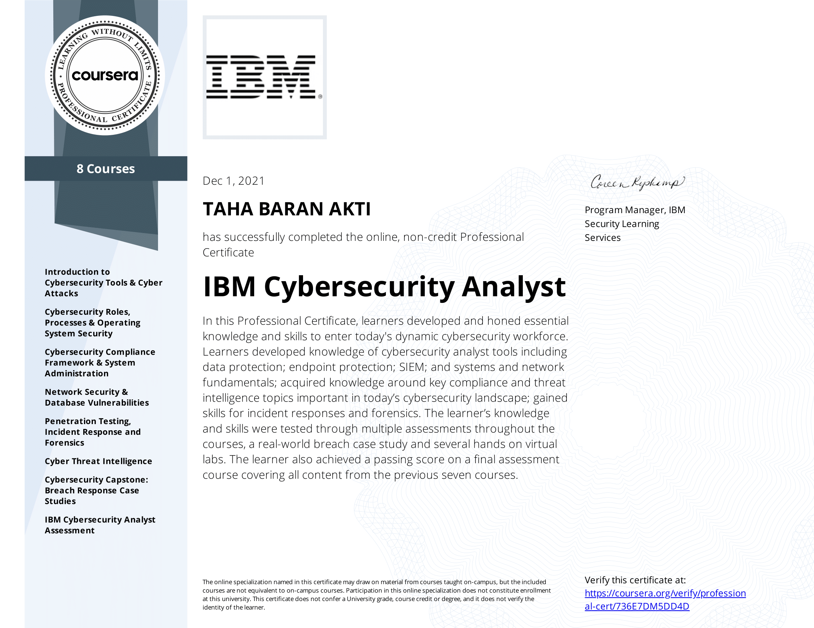

## [IBM Cybersecurity Analyst Professional Certificate](https://www.coursera.org/professional-certificates/ibm-cybersecurity-analyst)

 

* Feel free to contribute!

 

### About this Professional Certificate

The credential earner is ready for a career in cybersecurity with demonstrated ability to solve real-world problems. The individual has obtained knowledge of cybersecurity analyst tools including data protection; endpoint protection; SIEM; systems and network fundamentals; as well as key compliance and threat intelligence topics important in today’s cybersecurity landscape. The earner has also gained skills for incident responses and forensics.
The credential earner is ready for a career in cybersecurity with demonstrated ability to solve real-world problems. The individual has obtained knowledge of cybersecurity analyst tools including data protection; endpoint protection; SIEM; systems and network fundamentals; as well as key compliance and threat intelligence topics important in today’s cybersecurity landscape. The earner has also gained skills for incident responses and forensics.

### Course Certificates Completed

1. Introduction to Cybersecurity Tools & Cyber Attacks
2. Cybersecurity Roles, Processes & Operating System Security
3. Cyber Threat Intelligence
4. IBM Cybersecurity Analyst Assessment
5. Cybersecurity Capstone: Breach Response Case Studies
6. Penetration Testing, Incident Response and Forensics
7. Cybersecurity Compliance Framework & System Administration
8. Network Security & Database Vulnerabilities

### Skills you will gain

* Computer Security Incident Management 
* Cybersecurity analyst
* reaches
* Cyber Attaks
* Cybersecurity
* Data Protection
* Digital Forensics
* Exposed Data
* IBM New Collar
* IBM Security
* Incident Response
* Network Defense Tactics
* Penetration Testing
* Phishing
* Ransomware
* Scripting
* Security Analyst
* SIEM
* Threat Intelligence
* Threat Management
* Vulnerability Scanning
